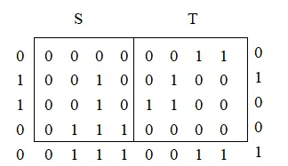
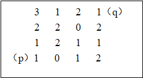

# 第一次作业

## 2.1．空间点(1,2,3)经 $\lambda=0.5$ 的镜头透视后的摄像机坐标和图像平面坐标应是什么?

摄像机笛卡尔坐标为

$$
\begin{bmatrix}
\frac{\lambda X}{\lambda - Z}  & \frac{\lambda Y}{\lambda - Z}  & \frac{\lambda Z}{\lambda - Z}
\end{bmatrix}^ \mathrm{ T } = \begin{bmatrix}
-0.2  & -0.4  & -0.6
\end{bmatrix}^ \mathrm{ T }
$$

图像平面笛卡尔坐标为

$$
\begin{bmatrix}
\frac{\lambda X}{\lambda - Z}  & \frac{\lambda Y}{\lambda - Z}
\end{bmatrix}^ \mathrm{ T } = \begin{bmatrix}
-0.2  & -0.4
\end{bmatrix}^ \mathrm{ T }
$$

## 2.2．设有2个图像子集如图所示，如果v={1}: 子集S和子集T是否：①4—连通 ②8—连通 ③m—连通
S和T ②8—连通 ③m—连通

## 2.3．考虑如图所示的图像子集：

### (1)令v={0，1}，计算p和q之间通路的D4 ，D8 和Dm长度

无D4通路    通路的D8最短长度：4   通路的Dm最短长度：5

### (2)令v={1，2}，计算p和q之间通路的D4 ，D8 和Dm长度

通路的D4最短长度：6    通路的D8最短长度：4    通路的Dm最短长度：6

## 2.4．给出将图像顺时针旋转$45^o$的变换矩阵，并利用该矩阵旋转图像点(x,y)=(1,0)

变换矩阵为

$$
\begin{bmatrix}
  \frac{\sqrt{2} }{2} & \frac{\sqrt{2} }{2} & 0 \\
  -\frac{\sqrt{2} }{2} & \frac{\sqrt{2} }{2} & 0 \\
  0 & 0 & 1
\end{bmatrix}
$$

利用该矩阵旋转 $(x,y)=(1,0)$ , 

$$
\begin{bmatrix}
 \frac{\sqrt{2} }{2}\\
 -\frac{\sqrt{2} }{2}\\
 1
\end{bmatrix}=\begin{bmatrix}
  \frac{\sqrt{2} }{2} & \frac{\sqrt{2} }{2} & 0 \\
  -\frac{\sqrt{2} }{2} & \frac{\sqrt{2} }{2} & 0 \\
  0 & 0 & 1
\end{bmatrix}\begin{bmatrix}
 1\\
 0\\
 1
\end{bmatrix}
$$

得到 $(x^{'},y^{'})=(\frac{\sqrt{2} }{2},-\frac{\sqrt{2} }{2})$

## 2.5. 设给定如下平移变换矩阵T和尺度变换矩阵S，分别计算对空间点(1,2,3)先平移变换后尺度变换和先尺度变换后平移变换所得到的结果，并进行比较讨论。

## 														

先平移变换再尺度变换

$$ 
\begin{bmatrix}
 12\\
 18\\
 18\\
 1
\end{bmatrix}=
\begin{bmatrix}
  4 & 0 & 0 & 0 \\
  0 & 3 & 0 & 0 \\
  0 & 0 & 2 & 0 \\
  0 & 0 & 0 & 1
\end{bmatrix} \begin{bmatrix}
  1 & 0 & 0 & 2 \\
  0 & 1 & 0 & 4 \\
  0 & 0 & 1 & 6 \\
  0 & 0 & 0 & 1
\end{bmatrix}\begin{bmatrix}
 1\\
 2\\
 3\\
 1
\end{bmatrix} 
$$

先尺度变换再平移变换

$$ 
\begin{bmatrix}
 6\\
 10\\
 12\\
 1
\end{bmatrix}=
\begin{bmatrix}
  1 & 0 & 0 & 2 \\
  0 & 1 & 0 & 4 \\
  0 & 0 & 1 & 6 \\
  0 & 0 & 0 & 1
\end{bmatrix} \begin{bmatrix}
  4 & 0 & 0 & 0 \\
  0 & 3 & 0 & 0 \\
  0 & 0 & 2 & 0 \\
  0 & 0 & 0 & 1
\end{bmatrix}\begin{bmatrix}
 1\\
 2\\
 3\\
 1
\end{bmatrix}
$$

先平移变换再尺度变换和先尺度变换再平移变换的结果不同，因为先进行平移变换时平移也会参与尺度变换，先尺度变换则不会。

## 2.6给出一个失真图上的三角形区域和校正图上与其对应的三角形区域，这两个三角形的顶点作为对应控制点，建立在线性失真情况下相对应的校正几何形变的空间变换式。

线性失真下校正几何形变的空间变换式为

$$
\begin{bmatrix}
 x^{'}\\
 y^{'}\\
 1
\end{bmatrix}=\begin{bmatrix}
 a1 & a2 & a3\\
 b1 & b2 & b3\\
 0  & 0  & 1
\end{bmatrix}\begin{bmatrix}
 x\\
 y\\
 1
\end{bmatrix}
$$

其中a1，a2，a3，b1，b2，b3为六个未知参数，根据三角形的三组对应顶点可列出方程

$$
\begin{bmatrix}
 x_{1} ^{'}\\
 x_{2} ^{'}\\
 x_{3} ^{'}
\end{bmatrix}=\begin{bmatrix}
 x_{1} & y_{1} & 1\\
 x_{2} & y_{2} & 1\\
 x_{3} & y_{3} & 1
\end{bmatrix}\begin{bmatrix}
 a_{1}\\
 a_{2}\\
 a_{3}
\end{bmatrix}
$$

与

$$
\begin{bmatrix}
 y_{1} ^{'}\\
 y_{2} ^{'}\\
 y_{3} ^{'}
\end{bmatrix}=\begin{bmatrix}
 x_{1} & y_{1} & 1\\
 x_{2} & y_{2} & 1\\
 x_{3} & y_{3} & 1
\end{bmatrix}\begin{bmatrix}
 b_{1}\\
 b_{2}\\
 b_{3}
\end{bmatrix}
$$

六个方程六个未知参数即可求解出空间变换式对应的变换矩阵
