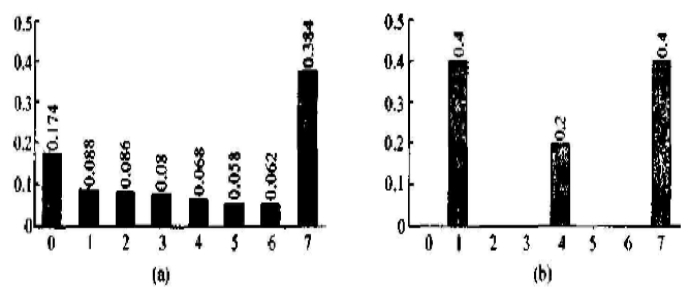
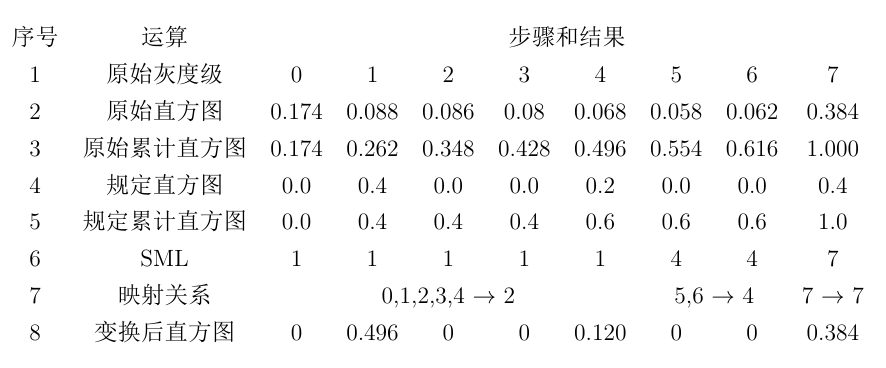
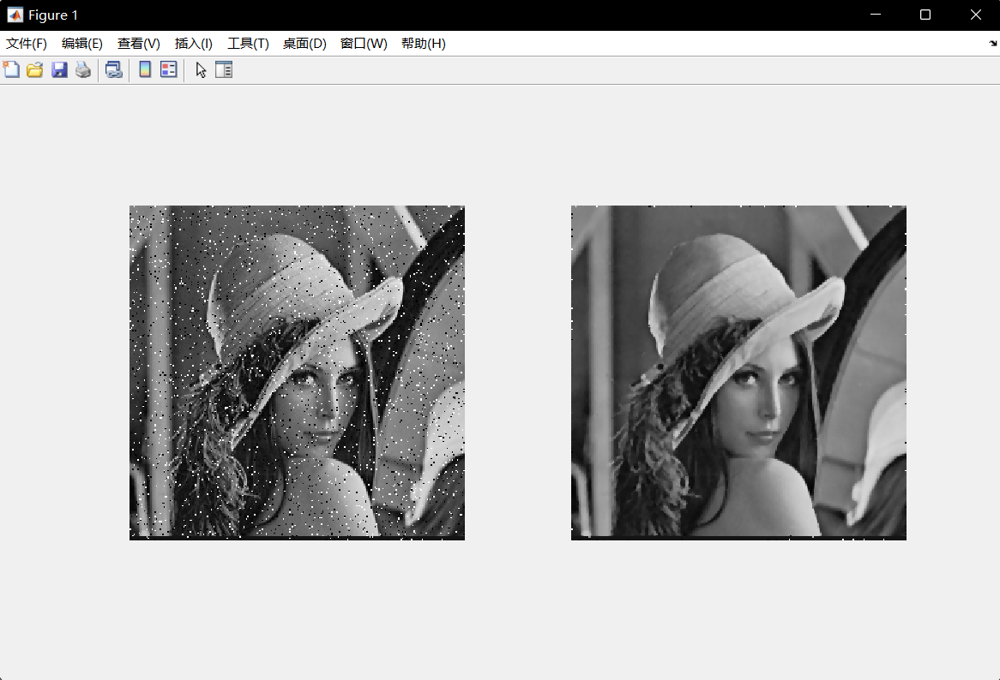

# 第二次作业

## 3.1为什么一般情况下对离散图像的直方图均衡化并不能产生完全平坦的直方图？

​	在离散图像中，直方图均衡的变换函数为求和形式，是对连续图像的积分形式的近似，存在误差。同时，直方图均衡化前后是灰度级一对一或多对一的关系，因此不能产生理想的完全平坦的直方图。

## 3.2设已用直方图均衡化技术对一幅数字图像进行了增强，试证明再用这个方法对所得结果增强并不会改变其结果。

​	在连续情况下，变换函数为 $s=\int_{0}^{r}p_r(x)dx$ ，在均衡化之后s的概率密度函数 $p_r(s)$ 满足 $p_s(s)\equiv 1$ ，再进行直方图均衡化时，变换函数为 $s'=\int_{0}^{s}p_s(x)dx=\int_{0}^{s}dx=s$ ，则再次直方图均衡化前后结果不变。

​	在离散情况下，变换函数为

$$
s_k={\sum_{i=0}^{k}} \frac{n_i}{n}
$$

对 $s_k$ 取整，得到 $S_k=int[(L-1)s_k+0.5]$ 。显然 $k\to S_k$ 的映射具有保序性，即若 $k_1 < k_2$ 有  $s_{k_1} < s_{k_2}$ ，则 $S_{k_1} < S_{k_2}$ 。对得到的增强图像再次进行直方图均衡化。若 $\nexists k\in [0,L-1] \quad s.t.S_k=j$ ，则在增强图像中灰度级为 $j$ 的像素个数为0，在第二次均衡化时不需考虑 $j$ 映射到的灰度级。若 $\exists k\in [0,L-1] \quad s.t.S_k=j$ ，则 

$$
s_{S_k}=\sum_{i=0}^{S_k}\frac{n^{'}_i}{n}
$$ 

则由保序性 

$$
s_{S_k}=\sum_{i=0}^{S_k}\frac{n^{'}_i}{n}=\sum_{i=0}^{k}\frac{n_i}{n}=s_k
$$ 

在第二次变换中，像素个数不为0的灰度级 $S_k$ 的映射关系 $S_k \to S_{S_k}(=S_k)$ 为恒同映射，可知再次直方图均衡化前后结果不变。

## 3.3设一幅图像有如下图(a)所示的直方图，拟对其进行规定直方图变换，所需规定直方图如下图(b)所示，使用SML方法，列表给出直方图规定化计算结果。

​	



## 3.4编一个程序实现 $n \times n$ 中值滤波器。当模板中心移过图像中每个位置时，设计一种简便地更新中值的方法。（要求给出编程思想）

​	$n \times n$ 的中值滤波器的MATLAB实现如下

```matlab
x = imread('lena.bmp');
n = 3;
[r, c] = size(x);
y = x;
for i = 1 : r - (n - 1)  
    for j = 1: c - (n - 1)  
        y(i + (n - 1) / 2,j + (n - 1) / 2)=median(x(i : i + (n - 1),j:j + (n - 1)),'all'); 
    end  
end 

```

​	对加入椒盐噪声的Lena图以n=3进行中值滤波处理的前后效果如下



​	当 $n \times n$ 的模板横向或纵向移动时，每移动一格只有n个数发生变化，可以维护一个存储当前模板内 $n \times n$ 个数的队列，按模板移动时的出队次序入队，每次移动模板时，将队头的n个元素出队，将新加入的n个元素入队到队尾，即可得到模板移动后的 $n \times n$ 个元素，再使用排序算法得到中值。

