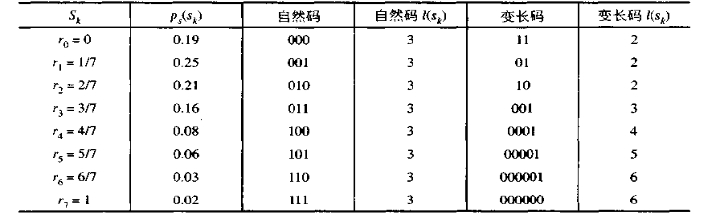
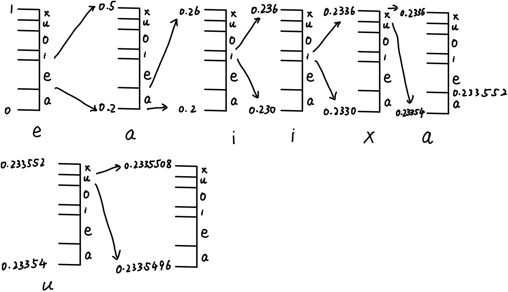

# 第六次作业

## 1.（1）请说明是否能用变长编码压缩一幅已直方图均衡化的具有 $2^n$ 级灰度的图？（2）这样的图像中包含像素间冗余吗？

​	（1）不能，直方图均衡化后各灰度值出现的概率非常接近，采用变长编码难以压缩。

​	（2）这样的图像中可能包含像素间冗余，直方图是一维的，进行直方图均衡化后的图像在结构或几何关系上可能仍具有像素之间的相关性。

## 2.

### （1）计算下表中给出符号概率的信源的熵

$$
-\sum_{i} p_i\log_{2}{p_i} = 2.65
$$

### （2）对信源符号构造哈夫曼码，解释这样构造的码与表中第2种码的区别

| 符号 | 概率 |  码字  | 概率 | 码字  | 概率 | 码字 | 概率 | 码字 | 概率 | 码字 | 概率 | 码字 | 概率 | 码字 |
| :--: | :--: | :----: | :--: | :---: | :--: | :--: | :--: | :--: | :--: | :--: | :--: | :--: | :--: | ---- |
|  s1  | 0.25 |   01   | 0.25 |  01   | 0.25 |  01  | 0.25 |  01  | 0.35 |  00  | 0.4  |  1   | 0.6  | 0    |
|  s2  | 0.21 |   10   | 0.21 |  10   | 0.21 |  10  | 0.21 |  10  | 0.25 |  01  | 0.35 |  00  | 0.4  | 1    |
|  s0  | 0.19 |   11   | 0.19 |  11   | 0.19 |  11  | 0.19 |  11  | 0.21 |  10  | 0.25 |  01  |      |      |
|  s3  | 0.16 |  001   | 0.16 |  001  | 0.16 | 001  | 0.19 | 000  | 0.19 |  11  |      |      |      |      |
|  s4  | 0.08 |  0001  | 0.08 | 0001  | 0.11 | 0000 | 0.16 | 001  |      |      |      |      |      |      |
|  s5  | 0.06 | 00000  | 0.06 | 00000 | 0.08 | 0001 |      |      |      |      |      |      |      |      |
|  s6  | 0.03 | 000010 | 0.05 | 00001 |      |      |      |      |      |      |      |      |      |      |
|  s7  | 0.02 | 000011 |      |       |      |      |      |      |      |      |      |      |      |      |

这样构造的码和表中第二种码的平均长度相同，只是某一符号的码字不同

### （3）构造最优的B1码

| 符号 | 概率 |  码字  |
| :--: | :--: | :----: |
|  s1  | 0.25 |   C0   |
|  s2  | 0.21 |   C1   |
|  s0  | 0.19 |  C0C0  |
|  s3  | 0.16 |  C0C1  |
|  s4  | 0.08 |  C1C0  |
|  s5  | 0.06 |  C1C1  |
|  s6  | 0.03 | C0C0C0 |
|  s7  | 0.02 | C0C0C1 |

### （4）构造最优的2bit二元平移码

| 符号 | 概率 |   码字   |
| :--: | :--: | :------: |
|  s1  | 0.25 |    00    |
|  s2  | 0.21 |    01    |
|  s0  | 0.19 |    10    |
|  s3  | 0.16 |  11 00   |
|  s4  | 0.08 |  11 01   |
|  s5  | 0.06 |  11 10   |
|  s6  | 0.03 | 11 11 00 |
|  s7  | 0.02 | 11 11 01 |

### （5）将所有符号分成2组，每组4个，然后构造最优的哈夫曼平移码

| 符号 | 概率 |  码字   |
| :--: | :--: | :-----: |
|  s1  | 0.25 |   01    |
|  s2  | 0.21 |   10    |
|  s0  | 0.19 |   11    |
|  s3  | 0.16 |   001   |
|  s4  | 0.08 | 000 01  |
|  s5  | 0.06 | 000 10  |
|  s6  | 0.03 | 000 11  |
|  s7  | 0.02 | 000 001 |

### （6）对每个码计算平均字长，并将它们与（1）中算得的熵进行比较

​	(2) 哈夫曼码 2.7

​	(3) B1码 3.18

​	(4) 2bit二元平移码 2.8

​	(5) 哈夫曼平移码 2.75

​	每个码的平均字长都大于熵，其中哈夫曼码最接近为最优码，其它三种为次优码

## 3.已知符号a,e,i,o,u,x的出现概率分别是0.2,0.3,0.1,0.2,0.1,0.1，对0.23355进行算术解码。

## 4.将下面给定的图像分解成3个位面，然后用游程编码方法逐行编码，给出码字，计算编码效率。

| 1    | 0    | 0    | 0    | 4    | 4    | 0    | 0    |
| ---- | ---- | ---- | ---- | ---- | ---- | ---- | ---- |
| 1    | 0    | 0    | 7    | 4    | 4    | 0    | 0    |
| 1    | 2    | 0    | 7    | 6    | 5    | 4    | 3    |
| 2    | 2    | 2    | 2    | 6    | 6    | 0    | 0    |

二值位平面(bit0)

| 1    | 0    | 0    | 0    | 0    | 0    | 0    | 0    |
| ---- | ---- | ---- | ---- | ---- | ---- | ---- | ---- |
| 1    | 0    | 0    | 1    | 0    | 0    | 0    | 0    |
| 1    | 0    | 0    | 1    | 0    | 1    | 0    | 1    |
| 0    | 0    | 0    | 0    | 0    | 0    | 0    | 0    |

游程编码 	1b 7W;  1b 2W 1b 4W;  1b 2W 1b 1W 1b 1W 1b;  0b 8W

二值位平面(bit1)

| 0    | 0    | 0    | 0    | 0    | 0    | 0    | 0    |
| ---- | ---- | ---- | ---- | ---- | ---- | ---- | ---- |
| 0    | 0    | 0    | 1    | 0    | 0    | 0    | 0    |
| 0    | 1    | 0    | 1    | 1    | 0    | 0    | 1    |
| 1    | 1    | 1    | 1    | 1    | 1    | 0    | 0    |

游程编码 	0b 8W;  0b 3W 1b 4W;  0b 1W 1b 1W 2b 2W 1b;  6b 2W

二值位平面(bit2)

| 0    | 0    | 0    | 0    | 1    | 1    | 0    | 0    |
| ---- | ---- | ---- | ---- | ---- | ---- | ---- | ---- |
| 0    | 0    | 0    | 1    | 1    | 1    | 0    | 0    |
| 0    | 0    | 0    | 1    | 1    | 1    | 1    | 0    |
| 0    | 0    | 0    | 0    | 1    | 1    | 0    | 0    |

游程编码 	0b 4W 2b 2W;  0b 3W 3b 2W;  0b 3W 4b 1W;  0b 4W 2b 2W

以上游程编码约定以黑色游程为起始

计数值最大为8，使用3bit表示，游程编码所需比特数为46*3=138

| 符号 | 概率 |
| :--: | :--: |
|  0   | 3/8  |
|  1   | 3/32 |
|  2   | 5/32 |
|  3   | 1/32 |
|  4   | 5/32 |
|  5   | 1/32 |
|  6   | 3/32 |
|  7   | 1/16 |

原图像的信息熵为 $-\sum_{i} p_i\log_{2}{p_i}*32(图像的像素数) = 82.25$ ，编码效率为 $82.25/138=59.6\%$
