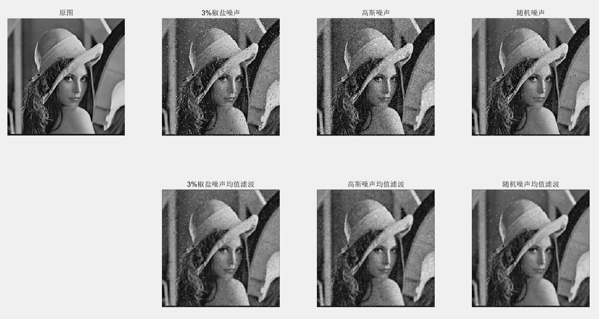

# 图像处理上机报告

## 实验一 图像几何变换

### 1、 图像的平移

- 使用`imread`读取灰度图像

- 使用`input`函数获得水平和垂直平移量
- 使用`imtranslate`对图像进行平移
- 使用`imshow`显示平移前后的图像对比

```matlab
source = imread('lena.bmp');
tx = input("水平平移量:");
ty = input("垂直平移量:");
output = imtranslate(source,[tx,ty]);
subplot(1,2,1); imshow(source); title('原图'); 
subplot(1,2,2); imshow(output); title('平移后'); 
```


### 2、图像的旋转

- 使用`imread`读取灰度图像

- 使用`input`函数获得旋转角度
- 使用`imrotate`对图像进行旋转，选择`最近邻插值`和`双线性插值`
- 使用`imshow`显示`最近邻插值`和`双线性插值`的图像对比

```matlab
source = imread('lena.bmp');
angle = input("旋转角度:");
output1 = imrotate(source,angle,'nearest','crop');%nearest为最近邻插值
output2 = imrotate(source,angle,'bilinear','crop');%bilinear为双线性插值
subplot(1,2,1); imshow(output1);title('最近邻插值');
subplot(1,2,2); imshow(output2);title('双线性插值');
```


### 3、图像的缩放

- 使用`imread`读取灰度图像

- 使用`input`函数获得水平和垂直缩放量
- 使用`imresize`对图像进行缩放，选择`最近邻插值`和`双线性插值`
- 使用`imshow`显示`最近邻插值`和`双线性插值`的图像对比

```matlab
source = imread('lena.bmp');
[r,l] = size(source);
x = input("水平缩放量:");
y = input("垂直缩放量:");
output1 = imresize(source,[r*y,l*x],'nearest');%nearest为最近邻插值
output2 = imresize(source,[r*y,l*x],'bilinear');%bilinear为双线性插值
subplot(1,2,1); imshow(output1);title('最近邻插值');
subplot(1,2,2); imshow(output2);title('双线性插值');
```


### 4、图像几何失真校正

- 使用`imread`读取几何失真图像与原图
- 使用`imshow`显示几何失真图像与原图

- 使用`ginput`函数获得控制点对
- 使用`fitgeotrans`基于控制点对对几何变换进行拟合
- 使用`imwarp`应用几何变换校正几何失真，选择`最近邻插值`和`双线性插值`
- 使用`imshow`显示`最近邻插值`和`双线性插值`的图像对比

```matlab
source = imread('alphabet2.jpg');
origin = imread('alphabet1.jpg');
subplot(1,2,1); imshow(source);
subplot(1,2,2); imshow(origin);
[x, y] = ginput(8);%获得几何失真图像与原图一一对应的四组控制点对
movingPoints = [x(1) y(1);x(3) y(3);x(5) y(5);x(7) y(7)];%几何失真图像控制点
fixedPoints = [x(2) y(2);x(4) y(4);x(6) y(6);x(8) y(8)];%原图控制点
tform = fitgeotrans(movingPoints,fixedPoints,'projective');%对几何变换拟合
output1 = imwarp(source,tform,'nearest');%nearest为最近邻插值
output2 = imwarp(source,tform,'bilinear');%bilinear为双线性插值
subplot(1,2,1); imshow(output1);title('最近邻插值');
subplot(1,2,2); imshow(output2);title('双线性插值');
```


## 实验二 图像点处理增强

### 1、灰度的线性变换

- 使用`imread`读取灰度图像

- 使用`input`函数获得斜率和截距
- 对图像上的每个点进行线性映射
- 使用`imshow`显示线性变换前后的图像对比

```matlab
source = imread('lena.bmp');
[r,l] = size(source);
output = zeros(r,l);
fa = input("斜率:");
fb = input("截距:");
for i = 1 : r
    for j = 1 : l
        output(i,j) = source(i,j)*fa+fb;%进行线性映射
    end
end
subplot(1,2,1); imshow(source); title('原图'); 
subplot(1,2,2); imshow(uint8(output)); title('线性变换后'); 
```


### 2、灰度拉伸

- 使用`imread`读取灰度图像

- 使用`input`函数获得转折点
- 使用自己定义的函数对图像进行灰度拉伸
- 使用`imshow`显示灰度拉伸前后的图像对比

```matlab
source = imread('lena.bmp');
[r,l] = size(source);
output = zeros(r,l);
x1 = input("x1:");
y1 = input("y1:");
x2 = input("x2:");
y2 = input("y2:");
for i = 1 : r
    for j = 1 : l
        output(i,j) = f(source(i,j),x1,y1,x2,y2);%进行线性映射
    end
end
subplot(1,2,1); imshow(source); title('原图'); 
subplot(1,2,2); imshow(uint8(output)); title('灰度拉伸后'); 

function [fx] = f(x,x1,y1,x2,y2)%灰度拉伸函数
    if(x < x1)
        fx = y1 / x1 * x;
    else
        if(x <= x2)
            fx = (y2 - y1)/(x2 - x1)*(x - x1) + y1;
        else
                fx = (255 - y2)/(255 - x2)*(x - x2) + y2;
        end
    end  
end
```


### 3、灰度直方图

- 使用`imread`读取灰度图像
- 使用`input`函数获得灰度直方图的下限和上限
- 使用`histogram`显示给定范围内的灰度直方图

```matlab
source = imread('lena.bmp');
min = input("下限:");
max = input("上限:");
histogram(source,'BinLimits',[min,max])%显示给定范围的灰度直方图
```


### 4、直方图均衡

- 使用`imread`读取灰度图像
- 使用`imshow`显示原图和原图直方图

- 使用`histeq`函数进行直方图均衡
- 使用`imshow`显示直方图均衡后的结果和对应的直方图
- 使用`histeq`进行直方图规定化，使用`normpdf`得到规定化所需的高斯函数
- 使用`imshow`显示直方图规定化后的结果和对应的直方图

```matlab
source = imread('pout.bmp');
subplot(3,2,1); imshow(source); title('原图'); 
subplot(3,2,2); histogram(source);title('原图直方图');
output1 = histeq(source);%直方图均衡
subplot(3,2,3); imshow(output1);title('直方图均衡');
subplot(3,2,4); histogram(output1);title('增强后直方图');
output2 = histeq(source,normpdf((0:1:255),127,40));%使用均值127，标准差40的高斯函数进行规定化
subplot(3,2,5); imshow(output2);title('直方图规定化');
subplot(3,2,6); histogram(output2);title('规定化后直方图');
```


## 实验三 图像空间域滤波增强

### 1、用均值滤波器去除图像中的噪声（选 3x3 窗口）

- 使用`imread`读取灰度图像
- 使用`imnoise`函数添加椒盐噪声和高斯噪声
- 编写了`Random`函数用于获取随机脉冲噪声
- 对每个噪声图像使用`imfilter`应用`fspecial`生成的3x3均值滤波器
- 使用`imshow`显示增强前后的图像对比

```matlab
source = imread('lena.bmp');
%添加噪声
pepper = imnoise(source,'salt & pepper',0.03);
gaussian = imnoise(source,'gaussian');
random = Random(source);
%均值滤波
pepper_output = imfilter(pepper,fspecial('average',3));
gaussian_output = imfilter(gaussian,fspecial('average',3));
poisson_output = imfilter(random,fspecial('average',3));
subplot(2,4,1); imshow(source); title('原图'); 
subplot(2,4,2); imshow(pepper); title('3%椒盐噪声'); 
subplot(2,4,3); imshow(gaussian); title('高斯噪声'); 
subplot(2,4,4); imshow(random); title('随机噪声'); 
subplot(2,4,6); imshow(pepper_output); title('3%椒盐噪声均值滤波'); 
subplot(2,4,7); imshow(gaussian_output); title('高斯噪声均值滤波'); 
subplot(2,4,8); imshow(poisson_output); title('随机噪声均值滤波'); 

%随机噪声
function [output] = Random(input)
    output = imnoise(input,'salt & pepper',0.03);
    [r,l] = size(output);
    for i = 1 : r
        for j = 1 : l
            if(output(i,j) ~= input(i,j))
                output(i,j) = uint8(rand()*255);
            end
        end
    end
end
```



### 2、用超限邻域平均法去除图像中的噪声：如果某个像素的灰度值大于其邻域像素的平均值，且达到了一定水平，则判断该像素为噪声，继而用邻域像素的均值取代这一像素值，

- 使用`imread`读取灰度图像
- 使用`imnoise`函数添加椒盐噪声和高斯噪声
- 编写了`Random`函数用于获取随机脉冲噪声
- 编写了`filter`函数进行3x3超限邻域滤波，其中用`mean`函数获得3x3范围内的均值
- 使用`imshow`显示增强前后的图像对比

```matlab
source = imread('lena.bmp');
%添加噪声
pepper = imnoise(source,'salt & pepper',0.03);
gaussian = imnoise(source,'gaussian');
random = Random(source);
%超限邻域平均滤波
pepper_output = filter(pepper,35);
gaussian_output = filter(gaussian,35);
poisson_output = filter(random,35);
subplot(2,4,1); imshow(source); title('原图'); 
subplot(2,4,2); imshow(pepper); title('3%椒盐噪声'); 
subplot(2,4,3); imshow(gaussian); title('高斯噪声'); 
subplot(2,4,4); imshow(random); title('随机噪声'); 
subplot(2,4,6); imshow(pepper_output); title('3%椒盐噪声超限邻域平均滤波'); 
subplot(2,4,7); imshow(gaussian_output); title('高斯噪声超限邻域平均滤波'); 
subplot(2,4,8); imshow(poisson_output); title('随机噪声超限邻域平均滤波'); 

function [output] = filter(input,T)
    output = input;
    [r,l] = size(output);
    for i = 2 : (r - 1)
        for j = 2 : (l - 1)
            mean_value = mean(mean(input(i - 1 : i + 1, j - 1 : j + 1)));%计算均值
            if(abs(double(input(i,j)) - mean_value) > T)%超限滤波
                output(i,j) = mean_value;
            end
        end
    end
end

%随机噪声
function [output] = Random(input)
    output = imnoise(input,'salt & pepper',0.03);
    [r,l] = size(output);
    for i = 1 : r
        for j = 1 : l
            if(output(i,j) ~= input(i,j))
                output(i,j) = uint8(rand()*255);
            end
        end
    end
end
```

阈值为35的结果如下


### 3、用中值滤波器去除图像中的噪声(选 3x3 窗口做中值滤波)

- 使用`imread`读取灰度图像
- 使用`imnoise`函数添加椒盐噪声和高斯噪声
- 编写了`Random`函数用于获取随机脉冲噪声
- 对每个噪声图像使用`medfilt2`进行中值滤波
- 使用`imshow`显示增强前后的图像对比

```matlab
source = imread('lena.bmp');
%添加噪声
pepper = imnoise(source,'salt & pepper',0.03);
gaussian = imnoise(source,'gaussian');
random = Random(source);
%中值滤波
pepper_output = medfilt2(pepper);
gaussian_output = medfilt2(gaussian);
speckle_output = medfilt2(random);
subplot(2,4,1); imshow(source); title('原图'); 
subplot(2,4,2); imshow(pepper); title('3%椒盐噪声'); 
subplot(2,4,3); imshow(gaussian); title('高斯噪声'); 
subplot(2,4,4); imshow(random); title('随机噪声'); 
subplot(2,4,6); imshow(pepper_output); title('3%椒盐噪声中值滤波'); 
subplot(2,4,7); imshow(gaussian_output); title('高斯噪声中值滤波'); 
subplot(2,4,8); imshow(speckle_output); title('随机噪声中值滤波'); 

%随机噪声
function [output] = Random(input)
    output = imnoise(input,'salt & pepper',0.03);
    [r,l] = size(output);
    for i = 1 : r
        for j = 1 : l
            if(output(i,j) ~= input(i,j))
                output(i,j) = uint8(rand()*255);
            end
        end
    end
end
```


### 4、用超限中值滤波器去除图像中的噪声：当某个像素的灰度值超过窗口中像素灰度值排序中间的那个值，且达到一定水平时，则判断该点为噪声，用灰度值排序中间的那个值来代替；否则还是保持原来的灰度值。

- 使用`imread`读取灰度图像
- 使用`imnoise`函数添加椒盐噪声和高斯噪声
- 编写了`Random`函数用于获取随机脉冲噪声
- 编写了`filter`函数进行3x3超限中值滤波，其中用`median`函数获得3x3范围内的中值
- 使用`imshow`显示增强前后的图像对比

```matlab
source = imread('lena.bmp');
%添加噪声
pepper = imnoise(source,'salt & pepper',0.03);
gaussian = imnoise(source,'gaussian');
random = Random(source);
%超限中值滤波
pepper_output = filter(pepper,35);
gaussian_output = filter(gaussian,35);
speckle_output = filter(random,35);
subplot(2,4,1); imshow(source); title('原图'); 
subplot(2,4,2); imshow(pepper); title('3%椒盐噪声'); 
subplot(2,4,3); imshow(gaussian); title('高斯噪声'); 
subplot(2,4,4); imshow(random); title('随机噪声'); 
subplot(2,4,6); imshow(pepper_output); title('3%椒盐噪声超限中值滤波'); 
subplot(2,4,7); imshow(gaussian_output); title('高斯噪声超限中值滤波'); 
subplot(2,4,8); imshow(speckle_output); title('随机噪声超限中值滤波'); 

%随机噪声
function [output] = filter(input,T)
    output = input;
    [r,l] = size(output);
    for i = 2 : (r - 1)
        for j = 2 : (l - 1)
            temp = input(i - 1 : i + 1, j - 1 : j + 1);
            middle_value = median(temp(:));
            if(abs(double(input(i,j)) - double(middle_value)) > T)
                output(i,j) = middle_value;
            end
        end
    end
end

function [output] = Random(input)
    output = imnoise(input,'salt & pepper',0.03);
    [r,l] = size(output);
    for i = 1 : r
        for j = 1 : l
            if(output(i,j) ~= input(i,j))
                output(i,j) = uint8(rand()*255);
            end
        end
    end
end
```


### 5.将四种处理方法的结果与原图比较，注意不同处理方法对边缘的影响。

- 四种处理结果中，超限均值滤波的效果好于均值滤波，超限中值滤波的效果好于中值滤波
- 中值滤波与超限中值滤波对于边缘细节的保留更好，均值滤波和超限均值滤波的边缘更平滑
- 对椒盐噪声和随机噪声，中值滤波与超限中值滤波效果较好
- 对高斯噪声，均值滤波和超限均值滤波效果较好

### 6． 边缘检测主要有以下几种常用的算子：

#### 1) Roberts 算子

#### 2) Sobel 算子

#### 3) Prewitt 算子

#### 4) 拉普拉斯算子

#### 5) Canny 算子

#### 要求：要求对 blood.bmp、 lena.bmp，分别用前面所述的算子进行边缘检测，显示边缘检测结果图像。

- 使用`imread`读取灰度图像
- 使用`edge`函数分别使用`Roberts 算子`、`Sobel 算子`、`Prewitt 算子`、`Canny 算子`进行边缘检测
- 使用`imfilter`应用两种`拉普拉斯算子`进行边缘检测
- 使用`imshow`显示边缘检测结果图像

```matlab
source = imread('lena.bmp');
%Roberts算子
Roberts = edge(source,'Roberts');
%Sobel算子
Sobel = edge(source,'Sobel');
%Prewitt算子
Prewitt = edge(source,'Prewitt');
%拉普拉斯算子
Laplacian1 = imfilter(source,fspecial('laplacian',0));
Laplacian2 = imfilter(source,[-1 -1 -1; -1 8 -1; -1 -1 -1]);
%Canny算子
Canny = edge(source,'Canny');

subplot(3,3,[1,3]); imshow(source); title('原图'); 
subplot(3,3,4); imshow(Roberts); title('Roberts'); 
subplot(3,3,5); imshow(Sobel); title('Sobel'); 
subplot(3,3,6); imshow(Prewitt); title('Prewitt'); 
subplot(3,3,7); imshow(Laplacian1); title('Laplacian1'); 
subplot(3,3,8); imshow(Laplacian2); title('Laplacian2'); 
subplot(3,3,9); imshow(Canny); title('Canny'); 
```

```matlab
source = imread('blood.bmp');
%Roberts算子
Roberts = edge(source,'Roberts');
%Sobel算子
Sobel = edge(source,'Sobel');
%Prewitt算子
Prewitt = edge(source,'Prewitt');
%拉普拉斯算子
Laplacian1 = imfilter(source,-fspecial('laplacian',0));
Laplacian2 = imfilter(source,[-1 -1 -1; -1 8 -1; -1 -1 -1]);
%Canny算子
Canny = edge(source,'Canny');

subplot(3,3,[1,3]); imshow(source); title('原图'); 
subplot(3,3,4); imshow(Roberts); title('Roberts'); 
subplot(3,3,5); imshow(Sobel); title('Sobel'); 
subplot(3,3,6); imshow(Prewitt); title('Prewitt'); 
subplot(3,3,7); imshow(Laplacian1); title('Laplacian1'); 
subplot(3,3,8); imshow(Laplacian2); title('Laplacian2'); 
subplot(3,3,9); imshow(Canny); title('Canny'); 

```


##  实验四 图像变换及频域滤波增强

### Fourier 变换与反变换

#### 1． 用 Fourier 变换算法，对 rect1.bmp 和 rect2.bmp 图像作二维 Fourier 变换；并显示其频谱。要求对幅度作变换（由于高、低频幅度相差很大），将低频移到中心点。

- 使用`imread`读取灰度图像
- 使用`fft2`对图像进行二维Fourier 变换
- 使用`fftshift`将图像的低频移至中心
- 使用`abs`将图像取幅度，得到幅度的变换结果
- 使用`imshow`显示频谱的幅度谱

#### 2． 用 Fourier 系数的幅度进行 Fourier 反变换，并显示其图像；

- 使用`imread`读取灰度图像
- 使用`fft2`对图像进行二维Fourier 变换
- 使用`abs`将图像取幅度，得到幅度的变换结果
- 使用`ifft2`将Fourier 系数的幅度进行 Fourier 反变换
- 使用`imshow`显示反变换的结果

#### 3． 用 Fourier 系数的相位进行 Fourier 反变换，并显示其图像；比较 3、4 的结果，评价人眼对图像幅频特性和相频特性的敏感度。

- 使用`imread`读取灰度图像
- 使用`fft2`对图像进行二维Fourier 变换
- 使用`angle`得到 Fourier 变换后的相位谱
- 使用`exp`将相位谱做以增强
- 使用`ifft2`将Fourier 系数的相位进行 Fourier 反变换
- 使用`imshow`显示反变换的结果

​	根据幅度和相位进行 Fourier 反变换的结果可知，幅频特性包含了图像亮度（能量）的分布，相频特性刻画了图像的边界轮廓信息，人眼对相频特性比幅频特性敏感，从相频特性中可以看出图像的轮廓从而知道图像的大致内容，而从幅频特性中只能看到亮暗分布，不知道图像所含的物体是什么。

#### 4． 将图像的 Fourier 变换置为其共轭后进行反变换，显示其图像，并与原始图像比较其差异。

- 使用`imread`读取灰度图像
- 使用`fft2`对图像进行二维Fourier 变换
- 使用`conj`将图像的 Fourier 变换置为其共轭
- 使用`ifft2`进行 Fourier 反变换
- 使用`imshow`显示反变换的结果

​	观察结果可知得到的图像是原始图像的对角镜像（相当于先进行水平镜像再进行垂直镜像），这是因为傅里叶变换的共轭对称性$F(u,v)=F^*(-u,-v)$

```matlab
source1 = imread('Rect1.bmp');
source2 = imread('Rect2.bmp');
%傅里叶变换
F1 = fft2(source1);
F2 = fft2(source2);
%移动低频至中心并增强
F1_shift = log(abs(fftshift(F1))+1);
F2_shift = log(abs(fftshift(F2))+1);
%幅度逆变换
IF1_abs = uint8(ifft2(abs(F1)));
IF2_abs = uint8(ifft2(abs(F2)));
%相位逆变换
IF1_angle = uint8(abs(ifft2(10000*exp(1i*angle(F1)))));
IF2_angle = uint8(abs(ifft2(10000*exp(1i*angle(F2)))));
%共轭逆变换
IF1_conj = ifft2(conj(F1));
IF2_conj = ifft2(conj(F2));
subplot(2,5,1); imshow(source1); title('rect1'); 
subplot(2,5,2); imshow(F1_shift,[]); title('rect1幅度谱'); 
subplot(2,5,3); imshow(IF1_abs); title('rect1幅度逆变换'); 
subplot(2,5,4); imshow(IF1_angle); title('rect1相位逆变换');
subplot(2,5,5); imshow(IF1_conj,[]); title('rect1傅里叶变换共轭逆变换');
subplot(2,5,6); imshow(source2); title('rect2'); 
subplot(2,5,7); imshow(F2_shift,[]); title('rect2幅度谱');
subplot(2,5,8); imshow(IF2_abs); title('rect2幅度逆变换'); 
subplot(2,5,9); imshow(IF2_angle); title('rect2相位逆变换'); 
subplot(2,5,10); imshow(IF2_conj,[]); title('rect2傅里叶变换共轭逆变换');
```


### 频域滤波

#### 5． 对图像 pout.bmp、Girl.bmp 分别采用理想低通滤波器、巴特沃斯低通滤波器和高斯低通滤波器（截止频率自选），再做反变换，观察不同截止频率下采用不同低通滤波器得到的图像与原图像的区别，特别注意振铃效应。

- 使用`imread`读取灰度图像
- 编写`ILPF`、`BLPF`、`ELPF`三个函数进行理想低通滤波、巴特沃斯低通滤波、高斯低通滤波
- 使用`size`获得图像的大小
- 使用`fft2`与`fftshift`对图像进行 Fourier 变换并将低频移至中心
- 使用`meshgrid`构建坐标矩阵
- 使用`hypot`在坐标矩阵上计算各点到中心点的距离
- 使用`ifft2`与`ifftshift`撤销`fftshift`的移动并进行逆 Fourier 变换
- 使用`imshow`显示低通滤波后的结果

```matlab
source1 = imread('Pout.bmp');
source2 = imread('Girl.bmp');
D = 35;
subplot(2,4,1); imshow(source1,[]); title('Pout'); 
subplot(2,4,2); imshow(ILPF(source1,D),[]); title('Pout理想低通滤波器'); 
subplot(2,4,3); imshow(BLPF(source1,D,1),[]); title('Pout巴特沃斯低通滤波器'); 
subplot(2,4,4); imshow(ELPF(source1,D,2),[]); title('Pout高斯低通滤波器');
subplot(2,4,5); imshow(source2); title('Girl'); 
subplot(2,4,6); imshow(ILPF(source2,D),[]); title('Girl理想低通滤波器');
subplot(2,4,7); imshow(BLPF(source2,D,1),[]); title('Girl巴特沃斯低通滤波器'); 
subplot(2,4,8); imshow(ELPF(source2,D,2),[]); title('Girl高斯低通滤波器'); 

%理想低通滤波器
function output = ILPF(input,D0)
    [r,l] = size(input);
    F = fftshift(fft2(input));%傅里叶变换并平移
    [U,V] = meshgrid(-l/2:l/2-1,-r/2:r/2-1);%构建坐标
    D = hypot(U,V);%计算中心偏移距离
    H = D <= D0 ;
    output = abs(ifft2(ifftshift(F.*H)));%卷积逆变换
end

%巴特沃斯低通滤波器
function output = BLPF(input,D0,n)
    [r,l] = size(input);
    F = fftshift(fft2(input));%傅里叶变换并平移
    [U,V] = meshgrid(-l/2:l/2-1,-r/2:r/2-1);%构建坐标
    D = hypot(U,V);%计算中心偏移距离
    H = 1./(1+((D./D0).^(2*n)));
    output = abs(ifft2(ifftshift(F.*H)));%卷积逆变换
end

%高斯低通滤波器
function output = ELPF(input,D0,n)
    [r,l] = size(input);
    F = fftshift(fft2(input));%傅里叶变换并平移
    [U,V] = meshgrid(-l/2:l/2-1,-r/2:r/2-1);%构建坐标
    D = hypot(U,V);%计算中心偏移距离
    H = exp(-(D./D0).^n);
    output = abs(ifft2(ifftshift(F.*H)));%卷积逆变换
end
```

阈值35的低通滤波


阈值5的低通滤波


阈值70的低通滤波


​	在较低阈值下，图像最平滑，但细节保留较少，理想低通滤波的振铃效应明显。在适中阈值下，图像得到了平滑，保留了较多细节，理想低通滤波相比另两种滤波有一定的振铃效应。在较高阈值下，图像在滤波前后没有明显变化，理想低通滤波的振铃效应也不可察觉。

#### 6． 对原始图像 Girl.bmp 分别加椒盐噪声、高斯噪声，产生有噪声图像，利用上述低通滤波器进行去噪，对比去噪效果。

- 使用`imread`读取灰度图像
- 使用`imnoise`添加椒盐噪声、高斯噪声
- 编写`ILPF`、`BLPF`、`ELPF`三个函数进行理想低通滤波、巴特沃斯低通滤波、高斯低通滤波
- 使用`size`获得图像的大小
- 使用`fft2`与`fftshift`对图像进行 Fourier 变换并将低频移至中心
- 使用`meshgrid`构建坐标矩阵
- 使用`hypot`在坐标矩阵上计算各点到中心点的距离
- 使用`ifft2`与`ifftshift`撤销`fftshift`的移动并进行逆 Fourier 变换
- 使用`imshow`显示噪声图像低通滤波后的结果

```matlab
source1 = imread('Pout.bmp');
source2 = imread('Girl.bmp');
%添加噪声
source1_pepper = imnoise(source1,'salt & pepper',0.03);
source1_gaussian = imnoise(source1,'gaussian');
source2_pepper = imnoise(source2,'salt & pepper',0.03);
source2_gaussian = imnoise(source2,'gaussian');

figure();
subplot(3,3,1); imshow(source1,[]); title('Pout'); 
subplot(3,3,2); imshow(source1_pepper,[]); title('Pout-椒盐噪声'); 
subplot(3,3,3); imshow(source1_gaussian,[]); title('Pout-高斯噪声'); 
subplot(3,3,4); imshow(ILPF(source1_pepper,35),[]); title('Pout-椒盐噪声理想低通滤波器'); 
subplot(3,3,5); imshow(BLPF(source1_pepper,35,1),[]); title('Pout-椒盐噪声巴特沃斯低通滤波器'); 
subplot(3,3,6); imshow(ELPF(source1_pepper,35,2),[]); title('Pout-椒盐噪声高斯低通滤波器');
subplot(3,3,7); imshow(ILPF(source1_gaussian,35),[]); title('Pout-高斯噪声理想低通滤波器'); 
subplot(3,3,8); imshow(BLPF(source1_gaussian,35,1),[]); title('Pout-高斯噪声巴特沃斯低通滤波器'); 
subplot(3,3,9); imshow(ELPF(source1_gaussian,35,2),[]); title('Pout-高斯噪声高斯低通滤波器');

figure();
subplot(3,3,1); imshow(source2,[]); title('Girl'); 
subplot(3,3,2); imshow(source2_pepper,[]); title('Girl-椒盐噪声'); 
subplot(3,3,3); imshow(source2_gaussian,[]); title('Girl-高斯噪声'); 
subplot(3,3,4); imshow(ILPF(source2_pepper,35),[]); title('Girl-椒盐噪声理想低通滤波器'); 
subplot(3,3,5); imshow(BLPF(source2_pepper,35,1),[]); title('Girl-椒盐噪声巴特沃斯低通滤波器'); 
subplot(3,3,6); imshow(ELPF(source2_pepper,35,1),[]); title('Girl-椒盐噪声高斯低通滤波器');
subplot(3,3,7); imshow(ILPF(source2_gaussian,35),[]); title('Girl-高斯噪声理想低通滤波器'); 
subplot(3,3,8); imshow(BLPF(source2_gaussian,35,1),[]); title('Girl-高斯噪声巴特沃斯低通滤波器'); 
subplot(3,3,9); imshow(ELPF(source2_gaussian,35,1),[]); title('Girl-高斯噪声高斯低通滤波器');

%理想低通滤波器
function output = ILPF(input,D0)
    [r,l] = size(input);
    F = fftshift(fft2(input));%傅里叶变换并平移
    [U,V] = meshgrid(-l/2:l/2-1,-r/2:r/2-1);%构建坐标
    D = hypot(U,V);%计算中心偏移距离
    H = D <= D0 ;
    output = abs(ifft2(ifftshift(F.*H)));%卷积逆变换
end

%巴特沃斯低通滤波器
function output = BLPF(input,D0,n)
    [r,l] = size(input);
    F = fftshift(fft2(input));%傅里叶变换并平移
    [U,V] = meshgrid(-l/2:l/2-1,-r/2:r/2-1);%构建坐标
    D = hypot(U,V);%计算中心偏移距离
    H = 1./(1+((D./D0).^(2*n)));
    output = abs(ifft2(ifftshift(F.*H)));%卷积逆变换
end

%高斯低通滤波器
function output = ELPF(input,D0,n)
    [r,l] = size(input);
    F = fftshift(fft2(input));%傅里叶变换并平移
    [U,V] = meshgrid(-l/2:l/2-1,-r/2:r/2-1);%构建坐标
    D = hypot(U,V);%计算中心偏移距离
    H = exp(-(D./D0).^n);
    output = abs(ifft2(ifftshift(F.*H)));%卷积逆变换
end
```


​	理想低通滤波器的振铃效果较为明显，降噪效果较差。巴特沃斯低通滤波和高斯低通滤波没有振铃效应，降噪效果基本相同，都优于理想低通滤波。

#### 7． 对图像 pout.bmp、Girl.bmp 分别采用高通滤波器、巴特沃斯高通滤波器和高斯高通滤波器（截止频率自选），再做反变换，观察不同截止频率下采用不同高通滤波器得到的图像与原图像的区别，特别注意振铃效应。

- 使用`imread`读取灰度图像
- 编写`ILPF`、`BLPF`、`ELPF`三个函数进行理想高通滤波、巴特沃斯高通滤波、高斯高通滤波
- 使用`size`获得图像的大小
- 使用`fft2`与`fftshift`对图像进行 Fourier 变换并将低频移至中心
- 使用`meshgrid`构建坐标矩阵
- 使用`hypot`在坐标矩阵上计算各点到中心点的距离
- 使用`ifft2`与`ifftshift`撤销`fftshift`的移动并进行逆 Fourier 变换
- 使用`imshow`显示高通滤波后的结果

```matlab
source1 = imread('Pout.bmp');
source2 = imread('Girl.bmp');
D = 15 ;
subplot(2,4,1); imshow(source1,[]); title('Pout'); 
subplot(2,4,2); imshow(ILPF(source1,D),[]); title('Pout理想高通滤波器'); 
subplot(2,4,3); imshow(BLPF(source1,D,1),[]); title('Pout巴特沃斯高通滤波器'); 
subplot(2,4,4); imshow(ELPF(source1,D,2),[]); title('Pout高斯高通滤波器');
subplot(2,4,5); imshow(source2); title('Girl'); 
subplot(2,4,6); imshow(ILPF(source2,D),[]); title('Girl理想高通滤波器');
subplot(2,4,7); imshow(BLPF(source2,D,1),[]); title('Girl巴特沃斯高通滤波器'); 
subplot(2,4,8); imshow(ELPF(source2,D,2),[]); title('Girl高斯高通滤波器'); 
 
%理想高通滤波器
function output = ILPF(input,D0)
    [r,l] = size(input);
    F = fftshift(fft2(input));%傅里叶变换并平移
    [U,V] = meshgrid(-l/2:l/2-1,-r/2:r/2-1);%构建坐标
    D = hypot(U,V);%计算中心偏移距离
    H = D > D0 ;
    output = abs(ifft2(ifftshift(F.*H)));%卷积逆变换
end

%巴特沃斯高通滤波器
function output = BLPF(input,D0,n)
    [r,l] = size(input);
    F = fftshift(fft2(input));%傅里叶变换并平移
    [U,V] = meshgrid(-l/2:l/2-1,-r/2:r/2-1);%构建坐标
    D = hypot(U,V);%计算中心偏移距离
    H = 1./(1+((D0./D).^(2*n)));
    output = abs(ifft2(ifftshift(F.*H)));%卷积逆变换
end

%高斯高通滤波器
function output = ELPF(input,D0,n)
    [r,l] = size(input);
    F = fftshift(fft2(input));%傅里叶变换并平移
    [U,V] = meshgrid(-l/2:l/2-1,-r/2:r/2-1);%构建坐标
    D = hypot(U,V);%计算中心偏移距离
    H = exp(-(D0./D).^n);
    output = abs(ifft2(ifftshift(F.*H)));%卷积逆变换
end
```

阈值15的高通滤波


阈值1的高通滤波


阈值50的高通滤波


​	在较高阈值下，图像保留的低频信息较少，图像最暗，部分不明显的轮廓被丢弃，理想高通滤波有振铃效应。在适中阈值下，保留了部分低频信息，提取出了高频的图像轮廓，理想高通滤波有一定振铃效应。在较低阈值下，图像在滤波前后没有明显变化，理想高通滤波的振铃效应也不可察觉。

#### 8． 对图像 pout.bmp 经过高频增强滤波，再进行直方图均衡化，显示结果图像； 对图像 pout.bmp 先进行直方图均衡化，再经过高频增强滤波，显示结果图像；观察对比不同处理顺序对结果图像的影响。

- 使用`imread`读取灰度图像
- 编写`ILPF`、`BLPF`、`ELPF`三个函数进行理想高频增强滤波、巴特沃斯高频增强滤波、高斯高频增强滤波
- 使用`size`获得图像的大小
- 使用`fft2`与`fftshift`对图像进行 Fourier 变换并将低频移至中心
- 使用`meshgrid`构建坐标矩阵
- 使用`hypot`在坐标矩阵上计算各点到中心点的距离
- 使用`ifft2`与`ifftshift`撤销`fftshift`的移动并进行逆 Fourier 变换
- 使用`histeq`进行直方图均衡化
- 使用`imshow`显示 先高频增强滤波后直方图均衡 和 先直方图均衡再高频增强滤波的结果

```matlab
source = imread('Pout.bmp');
D = 15;
n = 1;
a = 4;
b = 1;
subplot(2,4,1); imshow(source,[]); title('Pout'); 
subplot(2,4,2); imshow(histeq(uint8(ILPF(source,D,a,b)))); title('Pout理想高频-直方图'); 
subplot(2,4,3); imshow(histeq(uint8(BLPF(source,D,n,a,b)))); title('Pout巴特沃斯高频-直方图'); 
subplot(2,4,4); imshow(histeq(uint8(ELPF(source,D,n,a,b)))); title('Pout高斯高频-直方图');
subplot(2,4,6); imshow(ILPF(histeq(source),D,a,b),[]); title('Pout直方图-理想高频'); 
subplot(2,4,7); imshow(BLPF(histeq(source),D,n,a,b),[]); title('Pout直方图-巴特沃斯高频'); 
subplot(2,4,8); imshow(ELPF(histeq(source),D,n,a,b),[]); title('Pout直方图-高斯高频');

%理想高频滤波器
function output = ILPF(input,D0,a,b)
    [r,l] = size(input);
    F = fftshift(fft2(input));%傅里叶变换并平移
    [U,V] = meshgrid(-l/2:l/2-1,-r/2:r/2-1);%构建坐标
    D = hypot(U,V);%计算中心偏移距离
    H = D > D0 ;
    H = a * H + b;
    output = abs(ifft2(ifftshift(F.*H)));%卷积逆变换
end

%巴特沃斯高频滤波器
function output = BLPF(input,D0,n,a,b)
    [r,l] = size(input);
    F = fftshift(fft2(input));%傅里叶变换并平移
    [U,V] = meshgrid(-l/2:l/2-1,-r/2:r/2-1);%构建坐标
    D = hypot(U,V);%计算中心偏移距离
    H = 1./(1+((D0./D).^(2*n)));
    H = a * H + b;
    output = abs(ifft2(ifftshift(F.*H)));%卷积逆变换
end

%高斯高频滤波器
function output = ELPF(input,D0,n,a,b)
    [r,l] = size(input);
    F = fftshift(fft2(input));%傅里叶变换并平移
    [U,V] = meshgrid(-l/2:l/2-1,-r/2:r/2-1);%构建坐标
    D = hypot(U,V);%计算中心偏移距离
    H = exp((-D0./D).^n);
    H = a * H + b;
    output = abs(ifft2(ifftshift(F.*H)));%卷积逆变换
end
```

阈值为15，高频增强方程为$H_e(u,v)=4H(u,v)+1$的结果如下


​	先高频增强滤波再直方图均衡得到的图像较亮，先直方图均衡再高频增强滤波得到的图像较暗。这是因为直方图均衡可以让图像灰度分布均匀，因此高频增强滤波后直方图均衡得到较亮的结果。但先直方图均衡再高频增强滤波时，由于图像的能量集中在低频，高频增强滤波后图像失去大部分能量，因此较暗。

## 实验五 图像恢复与图像分割

### 1． 对图像 flower1.jpg 设置运动位移 30 个像素、运动方向 45 度，产生运动模糊图像，对其采用逆滤波和维纳滤波进行恢复，显示、对比分析恢复结果图像。对产生的运动模糊图像加高斯噪声，产生有噪声图像，分别对其采用逆滤波和维纳滤波进行恢复，显示、对比分析恢复结果图像。

- 使用`imread`读取灰度图像
- 使用`im2double`将图像的元素类型转换为double以便于后续计算方差
- 使用`fspecial`获得运动模糊滤波器
- 使用`imfilter`将运动模糊应用于原图像得到运动模糊的图像
- 使用`imnoise`在添加了运动模糊的图像上添加高斯噪声
- 使用`deconvwnr`进行逆滤波和维纳滤波，在无估计噪声的情况下，将噪信比设为0，维纳滤波退化为逆滤波。将噪信比指定为高斯噪声与图像的方差比就可以进行维纳滤波
- 使用`imshow`显示运动模糊图像、同时添加运动模糊与高斯噪声的图像、对这两种图像分别应用逆滤波和维纳滤波的结果

```matlab
source = im2double(imread('flower1.jpg'));
psf = fspecial('motion',30,45);%运动模糊滤波器
motion = imfilter(source,psf,'conv','circular');%产生运动模糊
noisy = imnoise(motion,'gauss',0,0.0001);%产生高斯噪声

subplot(2,4,1); imshow(source); title('flower1'); 
subplot(2,4,2); imshow(motion); title('flower1运动模糊'); 
subplot(2,4,3); imshow(deconvwnr(motion,psf)); title('flower1运动模糊逆滤波'); 
subplot(2,4,4); imshow(deconvwnr(motion,psf)); title('flower1运动模糊维纳滤波'); 
subplot(2,4,6); imshow(noisy); title('flower1运动模糊&高斯噪声'); 
subplot(2,4,7); imshow(deconvwnr(noisy,psf)); title('flower1运动模糊&高斯噪声逆滤波'); 
subplot(2,4,8); imshow(deconvwnr(noisy,psf,0.0001/var(motion(:)))); title('flower1运动模糊&高斯噪声维纳滤波'); 
```


​	在只添加运动模糊的情况下，逆滤波和维纳滤波本质上是等价的，都可以恢复得到原始图像。在同时添加运动模糊和高斯噪声的情况下，进行逆滤波时高频的高斯噪声会被放大，得到的结果效果很差，在进行维纳滤波时可以抑制噪声得到较好的结果，但噪声并不能完全去除，相比原图仍有一定噪声，这是因为虽然噪信比已知，但高斯噪声在图像上的分布是随机的，无法完全恢复。

### 2． 对图像 lena.bmp 采用大津法（OTSU）自动选取阈值进行分割，显示分割二值化结果图像。

- 使用`imread`读取灰度图像
- 编写`OSTU`函数使用大津法（OTSU）自动选取阈值。其中`miu`为均值累计矩阵，其第`i+2`项为灰度为`[0,i]`间的像素的均值，w为概率累计矩阵，其第`i+2`项为像素处于`[0,i]`的概率，之后用两个矩阵计算所有的类间方差矩阵g，取类间方差矩阵的最大值得到分割阈值T
- 使用`imbinarize`根据阈值将图像分割产生二值图像
- 使用`imshow`显示分别根据编写的`OSTU`函数和`Matlab`的库函数`graythresh`得到的阈值进行分割的结果

```matlab
source = imread('lena.bmp');
subplot(1,3,1); imshow(source); title('lena'); 
subplot(1,3,2); imshow(imbinarize(source, OSTU(source))); title('分割二值化结果'); 
subplot(1,3,3); imshow(imbinarize(source, graythresh(source))); title('分割二值化结果'); 

function T = OSTU(input)
    [r, l] = size(input);
    N = r * l;%获得像素点数
    miu = zeros(257);%均值累计矩阵
    w = zeros(257);%概率累计矩阵
    for i = 0 : 255
        p = length(find(input == i)) / N;%像素为i的像素所占比例
        miu(i+2) = miu(i+1) + p * i;
        w(i+2) = w(i+1) + p;
    end
    g = (w./(1-w)).*(miu./w-miu(257)).^2;
    T = (find(g==max(g))- 2)/255;
end
```


  库函数与编写的`OSTU`函数得到的结果相同

### 3． 对图像 cameraman.bmp 采用四叉树表达的迭代区域分裂合并算法进行分割。显示分割结果图像。

- 使用`imread`读取灰度图像

- 使用`qtdecomp`得到对原图像进行四叉树分割后的稀疏矩阵

- 使用`qtsetblk`设置各个大小的块的边界以获得分割图像

- 使用`imshow`显示分割后的图像

- 使用`qtgetblk`得到各个大小的块后，给每个块不同的编号

- 使用`boundarymask`得到指定编号的边界，再根据边界的编号查找相邻块

- 使用`range`得到合并区域的极差，将合并后能够小于阈值的块合并

- 使用`imshow`显示分割后的图像

  ```matlab
  source = imread('cameraman.bmp');
  subplot(1,3,1); imshow(source); title('原图'); 
  range_value = .35;
  S = qtdecomp(source,range_value,2);%四叉树分割
  blocks = zeros(256);
  
  %产生分块边界
  for dim = [64 32 16 8 4 2]
  	numblocks = length(find(S==dim));    
  	if (numblocks > 0)        
          values = repmat(uint8(1),[dim dim numblocks]);
          values(2:dim,2:dim,:) = 0;
          blocks = qtsetblk(blocks,S,dim,values);
    end
  end
  
  %产生分裂图
  output1 = source;
  output1(blocks==1) = 255;
  subplot(1,3,2); imshow(output1); title('分裂'); 
  
  %将各块分别标记
  i = 0;
  for dim = [64 32 16 8 4 2]
      [vals,r,c] = qtgetblk(source,S,dim);
      if ~isempty(vals)
          for j = 1:length(r)
              i = i + 1;
              blocks(r(j):r(j)+ dim - 1,c(j):c(j)+ dim - 1) = i;
          end
      end
  end
  
  %将极差较小的块的标记合并
  for j = 1 : i
      bound = boundarymask(blocks==j,4) & (~(blocks==j));
      [r,l] = find(bound==1);
      for k = 1 : size(r,1)
          merge = source((blocks==j) | (blocks==blocks(r(k),l(k))));
          if(range(merge(:))<range_value*256)
              blocks(blocks==blocks(r(k),l(k))) = j;
          end
      end
  end
  
  %根据标记重新分割
  output2 = source;
  for i = 2 : 255
      for j = 2 : 255
          if(blocks(i,j)~=blocks(i,j+1) || blocks(i,j)~=blocks(i+1,j))
              output2(i,j) = 255;
          end
      end
  end
  
  subplot(1,3,3); imshow(output2); title('合并'); 
  ```

  

